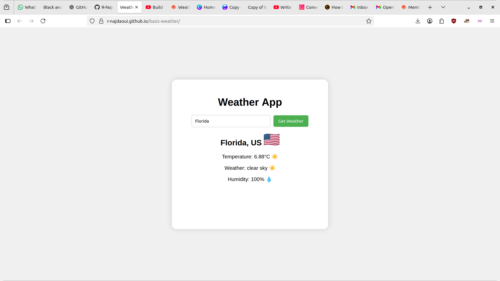

# 🌤️ A simple weather App
   
A simple, interactive weather app built with **HTML, CSS, and JavaScript**.  
It fetches live weather data using the **OpenWeatherMap API** and shows:
## Features
- Current temperature 🌡️
- Weather description with emojis ☀️☁️🌧️❄️
- Humidity 💧
- Country flags 🇺🇸🇫🇷🇯🇵
## 🖥️ live Demo
Check it out on GitHub Pages:
https://r-najdaoui.github.io/basic-weather/
## Screenshot

Technologies Used

HTML5

CSS3

JavaScript (ES6)

OpenWeatherMap API
